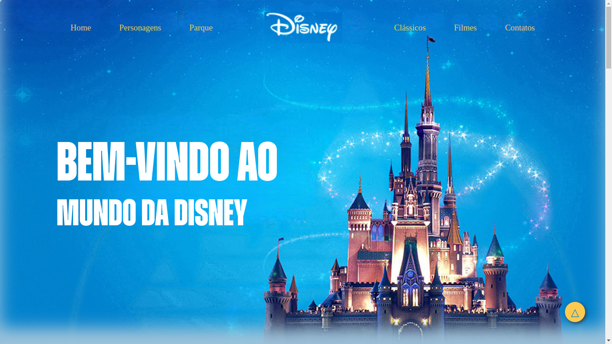

# One page - Disney

---
[Clique aqui](https://laylagiovanna.github.io/one-page-disney/) para acessar o site

---

## Sobre
Site do tipo one page para divulgar o desenvolvimento de uma atividade somativa dada pelo professor. O objetivo desse projeto é colocar em práticas os conhecimentos adquiridos no curso do [SENAi Jandira](https://jandira.sp.senai.br/) na criação de web sites

---

## Tecnologias utilizadas
- HTML
- CSS
- Responsividade
- Figma
- JS
- Markdown

---

## Equipe
- [Layla Giovanna](https://github.com/LaylaGiovanna)