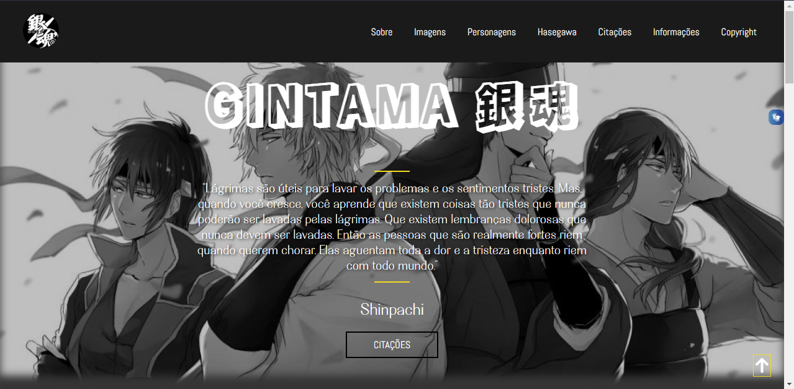
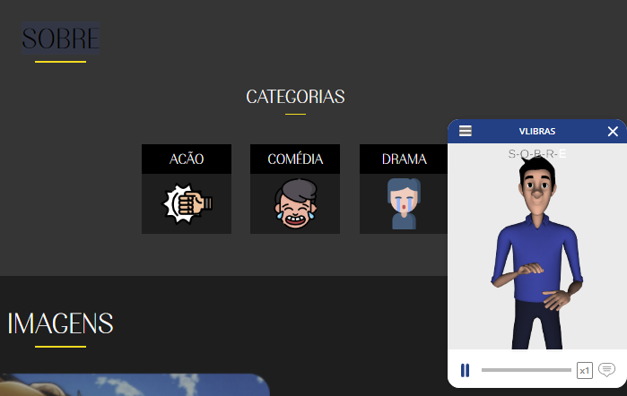
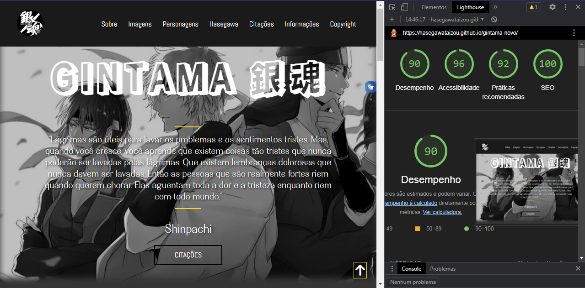

# DS1M - A - Caio Palermo Lemos

---

# Portfólio

[Clique aqui](hasegawataizou.github.io/one-page-2022/) para visitar o site.

---

## Sobre
Site do tipo one page para mostrar o meu anime favorito chamado "Gintama".
O objetivo deste projeto é colocar em prática os conhecimentos adquiridos no curso do [SENAI Jandira](https://jandira.sp.senai.br/) na criação de web sites, adquirir conhecimento sobre outras coisas das quais não foram abordadas no curso, e implementar o VLibras.

---
## Tecnologias
- HTML
- CSS
- Responsividade
- JS
- Figma
- Markdown
- VLibras

---

## VLibras
VLibras traduz conteúdos digitais (texto, áudio e vídeo) em Português para Libras, tornando computadores, celulares e plataformas Web mais acessíveis para as pessoas surdas.

Segue o Exemplo:

---
## Relatório do LightHouse
O LightHouse basicamente analisa todo o seu site, indicando como está determinados aspectos do mesmo. Segue o relatório:

---
## Desing
O Layout deste site foi baseado no Figma. Segue o link:

[Link do Figma](https://www.figma.com/file/yk6pZFeN8DjKeG8arN3DVA/GINTAMA?node-id=0%3A1)

---
## Equipe
- [Caio Palermo](https://github.com/HasegawaTaizou)
