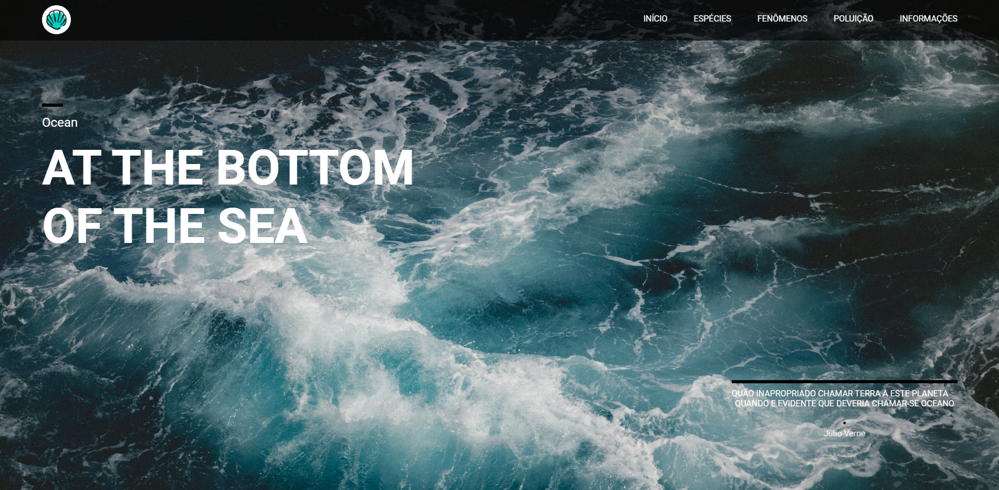
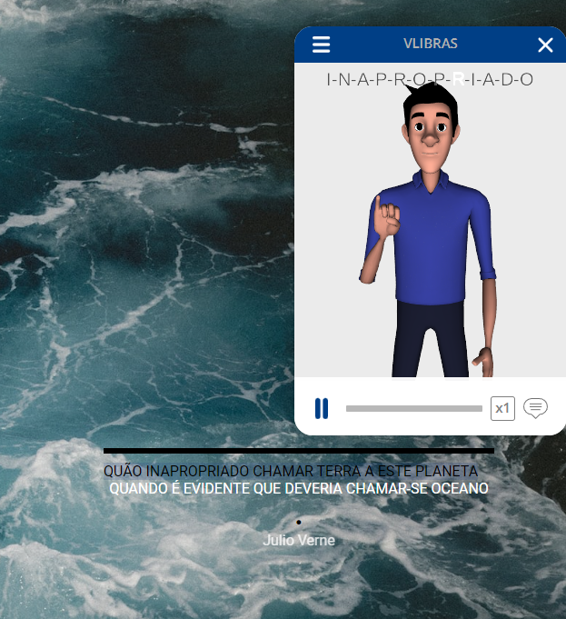
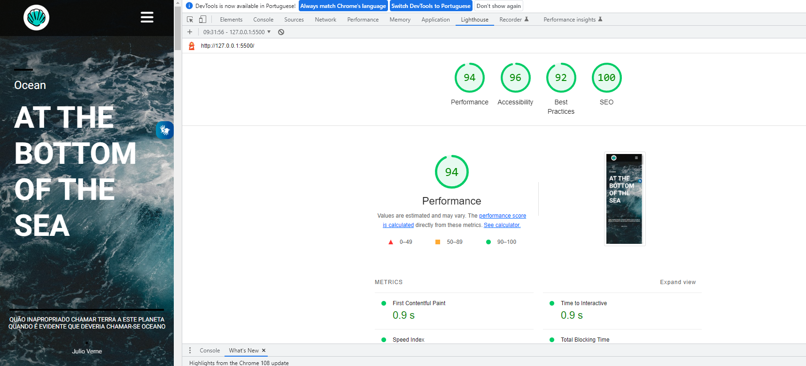

# one_page

[Clique aqui](https://camilapinh3iro.github.io/one_page/) para acessar o site. 

---
## Sobre 
Esse site é tipo one page e aborda o tema "Ocean". Nele contêm tipos de espécies marinhas, fenômenos naturais que ocorrem nos oceanos e o impacto da destinação e tratamento incorreto do lixo que geramos.

O objetivo deste projeto é colocar em prática os conhecimentos adquiridos no módulo de LIMA (Linguagem de Marcação) durante o primeiro semestre do curso de Desenvolvimento de Sistemas no [SENAI Jandira](https://jandira.sp.senai.br/). Além disso, incentivar a procura de outras técnicas para implementar no projeto, sendo o VLibras um requisito.

---
## Tecnologias Utilizadas 
- HTML
- CSS
- Markdown
- Responsividade
- Js
- Figma
- VLibras

---
## VLibras
O VLibras é um conjunto de ferramentas gratuitas e de código aberto que traduz conteúdos digitais (texto, áudio e vídeo) em Português para Libras, tornando computadores, celulares e plataformas Web mais acessíveis para as pessoas surdas.

---
## Relatório LightHouse
O Lighthouse é uma ferramenta automatizada que aprimora a qualidade dos apps da Web, simulando diversas situações que podem afetar a experiência do usuário.

---
## Figma
Utilizando a ferramenta de design Figma, desenvolvi o layout do projeto, planejando o desktop e o breakpoint para smartphones. 
Segue o link: 

[Link do Figma](https://www.figma.com/file/WAwSmu44wVoS0O2Bm60ZW3/Ocean?node-id=0%3A1&t=LTUnndAoIe2fdOVQ-0)

---
## Autor 
- [Camila Pinheiro](https://github.com/camilapinh3iro)
