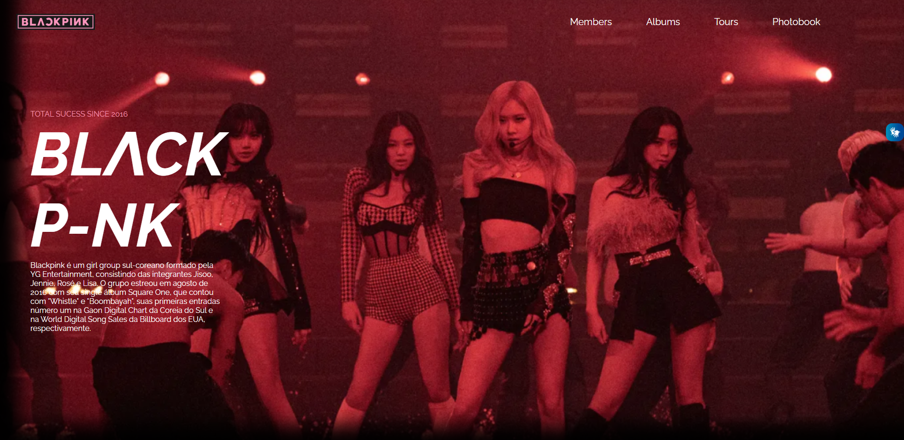
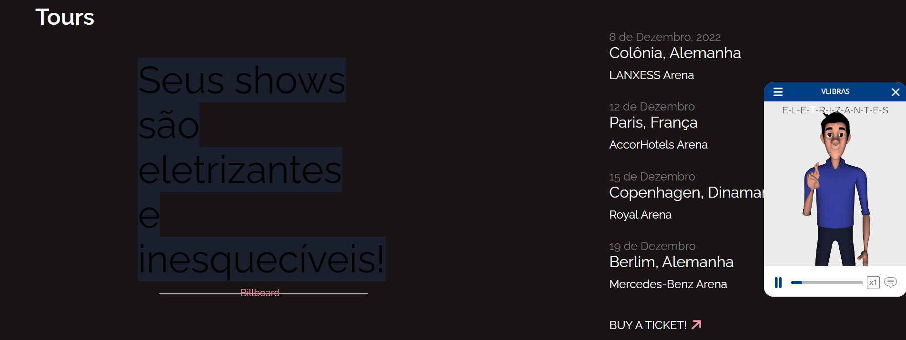
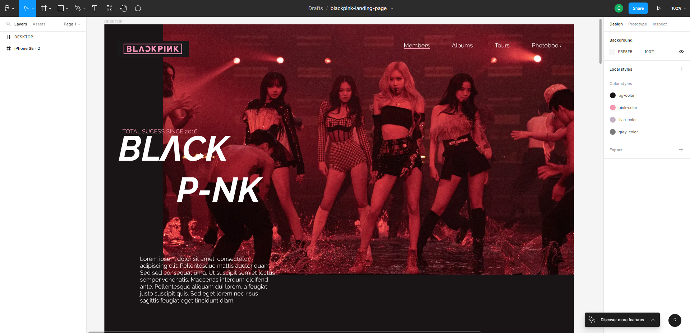

# DS1M - A - Clara Martins Oliveira

---

# BLΛCKP-NK

[Clique aqui]() para visitar o site.

---

## Sobre
Site do tipo one page para divulgar um grupo que eu gosto "Blackpink".
O objetivo deste projeto é colocar em prática os conhecimentos adquiridos no curso do [SENAI Jandira](https://jandira.sp.senai.br/) na criação de web sites, adquirir conhecimento sobre outras coisas das quais não foram abordadas no curso, e implementar o VLibras.

---
## Tecnologias
- HTML
- CSS
- Responsividade
- JS
- Figma
- VLibras

---

## VLibras
VLibras traduz conteúdos digitais (texto, áudio e vídeo) em Português para Libras, tornando computadores, celulares e plataformas Web mais acessíveis para as pessoas surdas.

Segue o Exemplo:

---
## Design
O Layout deste site foi baseado no Figma. 

Segue o link:

[Link do Figma](https://www.figma.com/file/WoWryNby2ay4Cq7H5Ja4Jg/blackpink-landing-page?node-id=0%3A1&t=8hhfKBGcKSja61HX-0)

---
## Equipe
- [Clara Martins Oliveira](https://github.com/oliveiraclara)

---
# Autoavaliação
- [ X ] `Prototipou o site utilizando o Figma?`
- [ ] Criou um cover, do figma, para divulgar o projeto?
- [ ] A navegabilidade é intuitiva?
- [ X ] As cores, imagens, botões, links e outros elementos tem designer padronizado? (Identidade visual)
- [ X ] `Codificou o site conforme planejado(protótipo)?`
- [ ] `[O site está responsivo?]`
- [  ] `Usou unidades de medida relativas, ou seja, criou um site flexivel?`
- [ ] `Utilizou media queries para a responsividade?`
- [ ] Utilizou a ferramenta lighthouse para verificar o desempenho, acessibilidade, boas praticas e SEO?
- [ ] `Otimizou as imagens para melhorar o desempenho?`
- [ ] O site foi codificado pensando na acessibilidade? 
- [ X ] `Implementou o vlibras no site?`
- [ X ] `Usou as TAG HTML pensando na semântica?`
- [ X ] Nomeou as classes utilizando algum padrão?
- [ X ] `Assinalou o projeto?`
- [ X ] `As seções criadas tem coerência com o projeto?`
- [ X ] `As seções estão organizadas seguindo algum objetivo?`
- [ X ] `O arquivo README descreve o projeto?`
- [ X ] O texto do README é objetivo e sucinto?
- [ X ] `O screenshot mostra um pouco do projeto?`
- [ X ] `Existe um link para o figma no README?`
- [ ] `Existe um link para o github page no README?`
- [ X ] `Existe um link do autor do projeto no README?`
- [ X ] Fez a autoavaliação?
