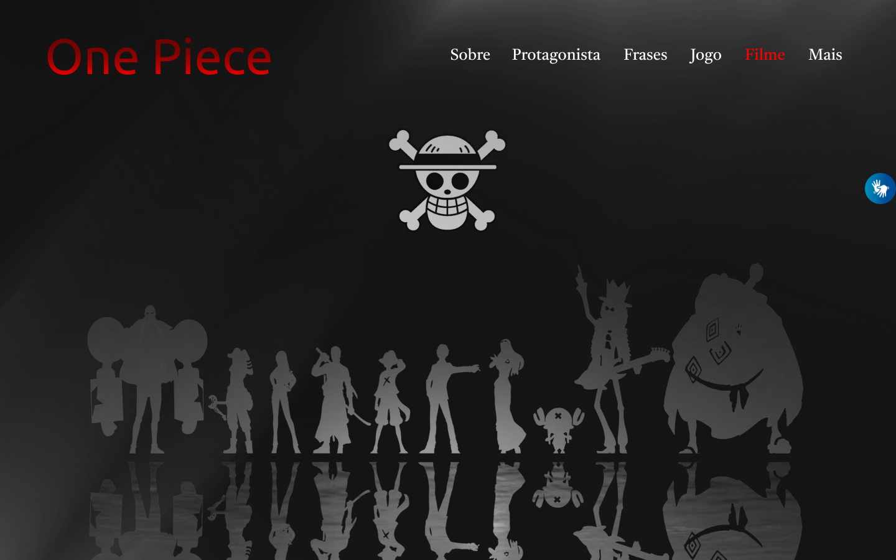

# One Piece

[Clique aqui](https://guilima005.github.io/site-one-piece/) para acessar o site.
---
## Sobre
Site do tipo one page para divulgar informações do anime One Piece.
O objetivo deste projeto é colocar em pratica os conhecimentos adquiridos no curso do [Senai Jandira](https://jandira.sp.senai.br/) na criação de web sites.

---
## Rascunho do Figma
- [Acessar o rascunho do Figma](https://www.figma.com/file/nAviZDWVXytTMvjIP5twIL/One-Piece?node-id=0%3A1&t=xL3QXPEYY7oRC6lm-0)
---

## Tecnologias utilizadas
- HTML
- CSS
- Responsividade
- Markdown
- VLibras
- Figma
---
## Autor
- [Guilherme Lima](https://github.com/GuiLima005)