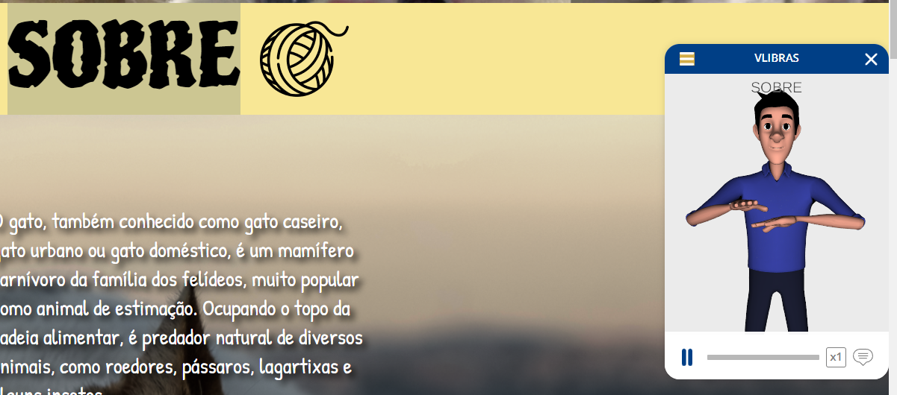
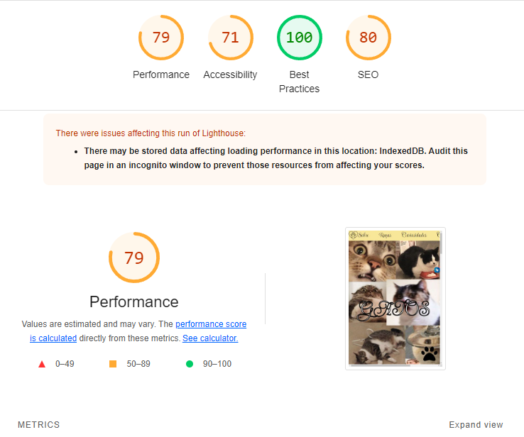

# DS1M - B - Paula Blesa Staniukaitis

---

# a cat's life

[Clique aqui](https://fernandoleonid.github.io/one-page-2022/ds1m-b/Paula-B/) para visitar o site.

---

## Sobre
Site do tipo one page para mostrar o meu animal favorito "Gatinho".
O objetivo deste projeto é colocar em prática os conhecimentos adquiridos no curso do [SENAI Jandira](https://jandira.sp.senai.br/) na criação de web sites, adquirir conhecimento sobre outras coisas das quais não foram abordadas no curso, e implementar o VLibras.

---
## Tecnologias
- HTML
- CSS
- Responsividade
- JS
- Figma
- Markdown
- VLibras

---

## VLibras
VLibras traduz conteúdos digitais (texto, áudio e vídeo) em Português para Libras, tornando computadores, celulares e plataformas Web mais acessíveis para as pessoas surdas.

Segue o Exemplo:

---
## Relatório do LightHouse
O LightHouse basicamente analisa todo o seu site, indicando como está determinados aspectos do mesmo. Segue o relatório:

---
## Design
O Layout deste site foi baseado no Figma. Segue o link:

[Link do Figma](https://www.figma.com/file/awt7Zx0ksGxr76PonirPKm/cats?node-id=75%3A162&t=PZGLDd6wyvbEGJMH-0)

---
## Equipe
- [Paula Blesa](https://github.com/StaniukaitisPaula)
---
## Critérios de Avaliação
- 
