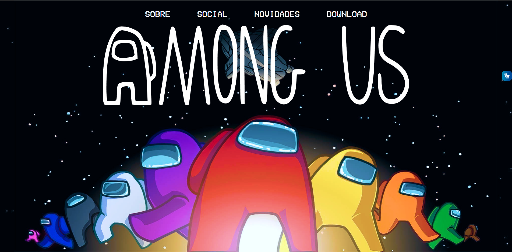

# PROJETOS - Turma DS1M-B

## Clique [aqui](https://github.com/fernandoleonid/one-page-2022) para ver a descrição do projeto

| Nome          | Código                        | Site                              |
| --------------| ------------------------------|-----------------------------------|
| [EduardoRibeiroPimenta](https://github.com/)     |[Sandman](./EduardoRibeiroPimenta/)      | |
| [Matheus Siqueira](https://github.com/ma7hs)     |[EZE Eletronics](./Matheus Siqueira/)      | |
| [Vinicius Nunes](https://github.com/VINICIUSNUNES137)     |[Sandman](./viniciusNunes/)      | |