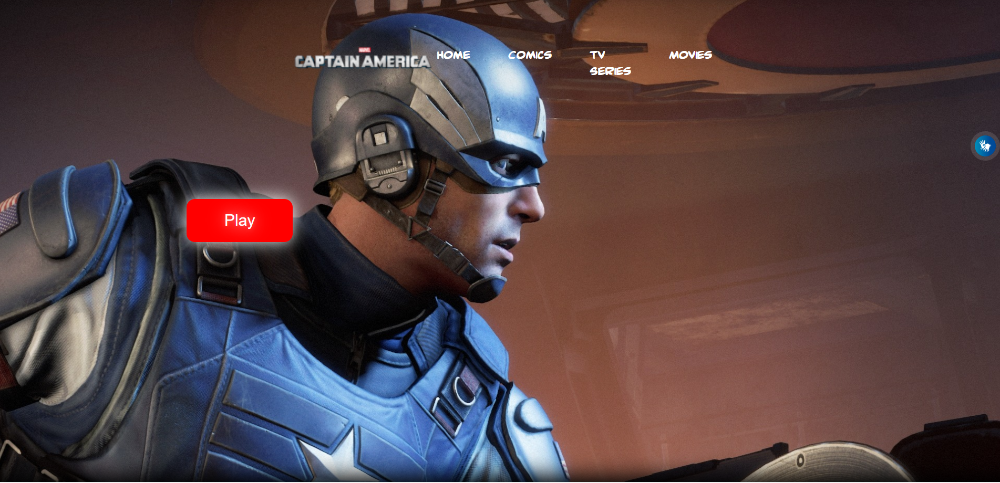

# Site-Cap

[Clique aqui](https://github.com/Vini01072003/Site-Cap) para acessar o site.

---
## Sobre
Site do tipo one page para divulgar informações da origem e história do capitão américa, incluindo suas aparições nas mídias da cultura pop.
O objetivo deste projeto é colocar em prática os conhecimentos adquiridos no curso do [Senai Jandira](https://jandira.sp.senai.br/curso/85566/127/tecnico-em-desenvolvimento-de-sistemas)

---
## Rascunho do Figma
-[Acessar o rascunho do Figma](https://www.figma.com/file/nFnIIZzNVe2ac3izYoFdMk/Site-Cap?node-id=0%3A1&t=z5YG7JfiH9FZSa2a-0)

--- 

## Tecnologias utilizadas
- HTML
- CSS
- Responsividade
- Markdom
- VLibras
- Figma

---
## Autor
- [Vinícius Alves](https://github.com/Vini01072003)