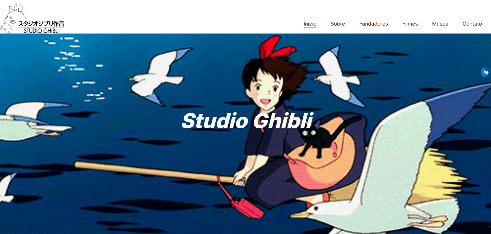

# One Page

## [Clique aqui](link) para acessar o site

---

## Sobre 
Site do tipo one page com a finalidade de divulgar o estúdio de cinema de animação japonês, Studio Ghibli. 

O objetivo deste projeto é colocar em prática os conhecimentos sobre desenvolvimento de sites, adquiridos no curso do [SENAI Jandira](https://jandira.sp.senai.br/), adquirir conteúdos que não foram abordados e implementar o VLibras!

---
## Planejamento
Segue abaixo o link do Figma, onde o layout do projeto foi baseado:

[Linkz FIGMA](https://www.figma.com/file/DKCaOyVyBYcKO8SMFsMCjP/Studio-Ghibli?node-id=0%3A1&t=G52tHU0ZR93RHldm-0)

## Tecnologias utilizadas
- HTML 5
- CSS3
- Figma
- VLibras
- Markdown
- Responsividade

---

## Autor
- [Letícia Evelin](https://github.com/leticia-evelin)