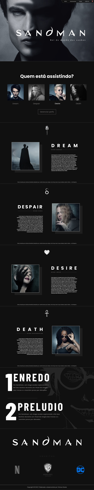

# **ONE PAGE - SANDMAN**

## [Clique aqui](https://viniciusnunes137.github.io/one-page-2022/ds1m-b/viniciusNunes/) para acessar o site

## **SOBRE**

- Site tipo do One Page com a finalidade de divulgação da série adaptada das HQ's SANDMAN.
- - Esse projeto foi proposto pelo professor de Linguagem de Marcação com objetivo de projetarmos um site no FIGMA no estilo One Page, contudo foi concebido alguns critérios, segue abaixo:

### **TO DO LIST:**

- [x] Projetar um site One Page no [FIGMA](https://www.figma.com/file/H9cP1AtEc5On4kY8C4HL2s/Sandman?node-id=1%3A2&t=WlCuZlimkDnHcC0w-1)
- [x] Possuir a quantidade de sessões ≥ 4
- [x] Implementar o clean code
- [X] Integrar a API [VLibras](https://www.gov.br/governodigital/pt-br/vlibras)
- [X] Tornar o projeto responsivo
- [X] Entregar via Pull Request

## **TECNOLOGIAS APLICADAS**

- HTML5
- CSS3

## **FERRAMENTAS**

- VSCODE
- GITHUB / GIT
- FIGMA
- FONT-AWESOME

## **CONCEITOS APLICADOS**

- @MEDIA
- HOVER
- FILTER
- API

## **AUTOR**

 
