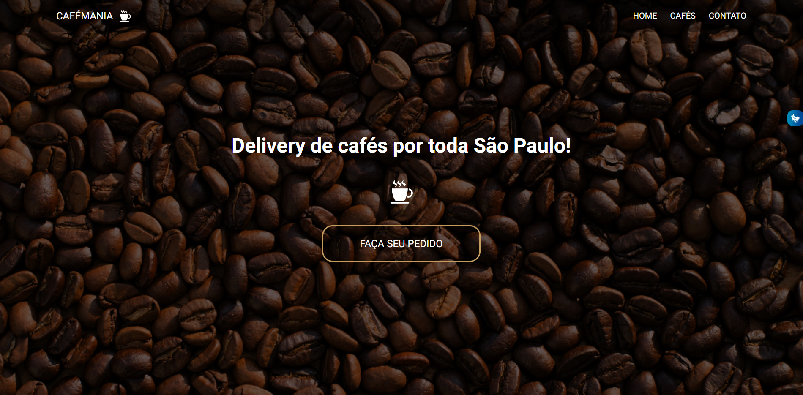
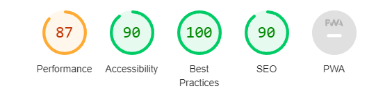

# CAFEMANIA

- [Link do site](https://fernandoleonid.github.io/one-page-2022/ds1t-a/Alexssandro/index.html)

---

## Sobre

Projeto do tipo one-page com o tema livre. Nesse caso, o tema escolhido foi uma cafeteria delivery fictícia chamada de CafeMania. No site é disposto informações referentes ao produto vendido, quem é a empresa, localização e contato da empresa, entre outras coisas.

O objetivo deste projeto é colocar em prática os conhecimentos adquiridos no curso do [Senai Jandira](https://jandira.sp.senai.br/). 

---

## Tecnologias Utilizadas

- HTML
- CSS
- Responsividade
- Markdown
- Vlibras 
- Figma
- FontAwesome

---

## Relatório do lighthouse

Nota que o lighthouse deu ao meu site. 

---

## Protótipo do site 

Antes da realização do site fiz o protótipo no figma, tanto do desktop quanto do mobile.

- [Clique aqui para ver o figma](https://www.figma.com/file/xTqy0QaMjIWs8Ck3YavBbx/Cafeteria?node-id=151%3A1750&t=6vdqmxUPXpkrBvgf-0)

## Autor

- [Alexssandro da Silva Gomes](https://github.com/AlexssandroSilvaGomes)
