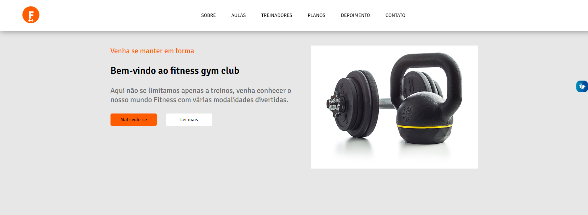

# One page Academia
## Projeto realizado para colocar conhecimentos em prática

### Linguagens Utlizadas
* HTML
* CSS
* JAVASCRIPT
### Autor: Anderson Reis

[Figma](https://www.figma.com/file/HxxJM1N8e3qzo5IboEbNpV/Untitled?t=YlR7gKE3FKWaEiRD-0) 
[Github](https://andersoreeis.github.io/Projeto-academia/)