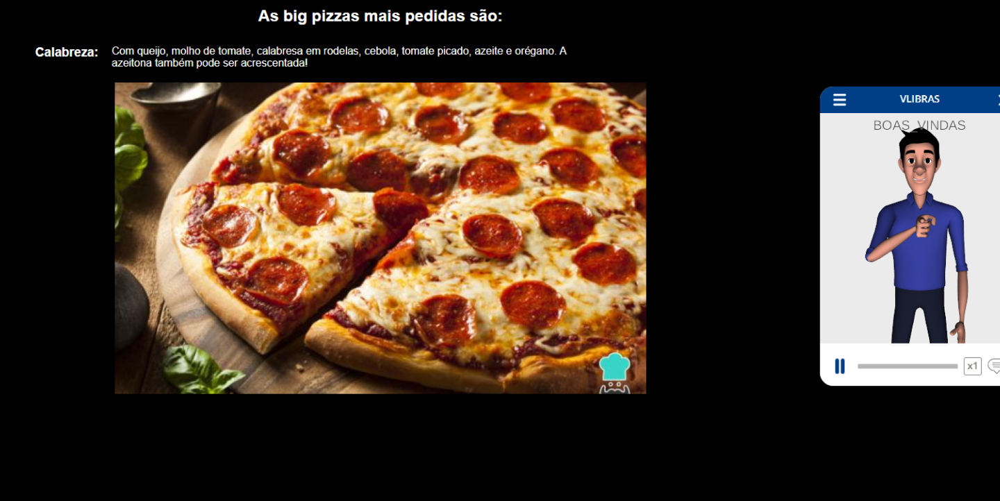
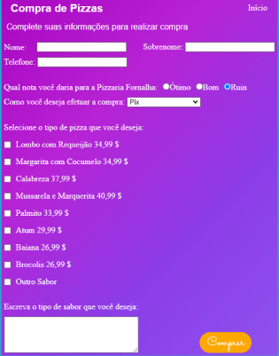

# PizzariaFornalha

---

### Sobre esse site:

Esse site do tipo empresarial foi desenvolvido tendo o principal objetivo colocar em prática os conhecimentos adqueridos durante o curso de front-end no decorrer dos 6 meses de aula.

---
### Tecnologias utilizadas

- HTML
- CSS
- JAVASCRIPT
- RESPONSIVIDADE
- MARKDOWN
- ACESIBILIDADE

---
### Acesibilidade para pessoas com  deficiência auditiva

---

### Diferencial do projeto

Nesse projeto foi desenvolvido um fómulario para compra.Esse formulario foi desenvolvido com pesquisas fora do horário de aula.

---
## AUTOR

- [Gustavo Henrique](https://github.com/GustavoHenriqueProjects)
- [Pizzaria Fornalha](https://gustavohenriqueprojects.github.io/PizzariaFornalha/)

