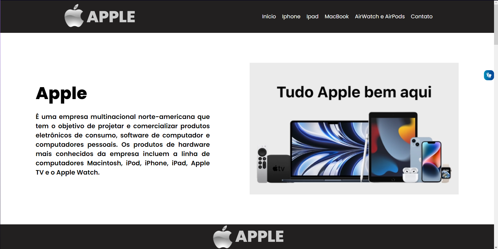
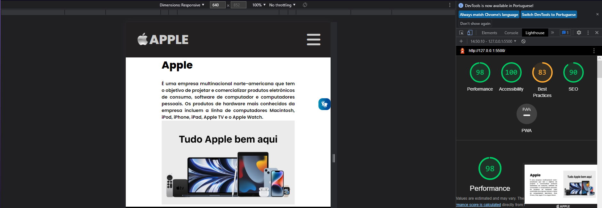

# DS1T - A - LUIZ GUSTAVO

- [Link do site](https://luyz-dev.github.io/one-page-2022/ds1t-a/Luiz%20Gustavo/index.html)

---

## Sobre

Site do tipo one-page sobre a grande compania de tecnologia Apple. 
O objetivo deste projeto é colocar em prática os conhecimentos adquiridos no curso de Desenvolvimento de Sistemas do [Senai Jandira](https://jandira.sp.senai.br/). 

---

## Tecnologias Utilizadas

- HTML
- CSS
- Responsividade
- Markdown
- Vlibras 
- Figma
- FontAwesome

---

## Relatório do lighthouse

Nota que o lighthouse deu ao meu site. 

---

## Protótipo do site 

Antes da realização do site, fiz o protótipo no figma, tanto do desktop, quanto do mobile.

- [Clique aqui para ver o figma](https://www.figma.com/file/U3lJpIFlhrdxBW64o9ec0Q/ONE-PAGE-APPLE?node-id=0%3A1&t=ffipryhIWhAzuoYM-0)

## Autor
- [Luiz Gustavo](https://github.com/luyz-dev)

# Critérios de Avaliação
- [x] `Prototipou o site utilizando o Figma?`
- [ ] Criou um cover, do figma, para divulgar o projeto?
- [x] A navegabilidade é intuitiva?
- [x] As cores, imagens, botões, links e outros elementos tem designer padronizado? (Identidade visual)
- [x] `Codificou o site conforme planejado(protótipo)?`
- [x] `[O site está responsivo?]`
- [x] `Usou unidades de medida relativas, ou seja, criou um site flexivel?`
- [x] `Utilizou media queries para a responsividade?`
- [x] Utilizou a ferramenta lighthouse para verificar o desempenho, acessibilidade, boas praticas e SEO?
- [x] `Otimizou as imagens para melhorar o desempenho?`
- [x] O site foi codificado pensando na acessibilidade? 
- [x] `Implementou o vlibras no site?`
- [x] `Usou as TAG HTML pensando na semântica?`
- [x] Nomeou as classes utilizando algum padrão?
- [ ] `Assinalou o projeto?`
- [x] `As seções criadas tem coerência com o projeto?`
- [x] `As seções estão organizadas seguindo algum objetivo?`
- [x] `O arquivo README descreve o projeto?`
- [x] O texto do README é objetivo e sucinto?
- [x] `O screenshot mostra um pouco do projeto?`
- [x] `Existe um link para o figma no README?`
- [x] `Existe um link para o github page no README?`
- [x] `Existe um link do autor do projeto no README?`
- [x] Fez a autoavaliação?
