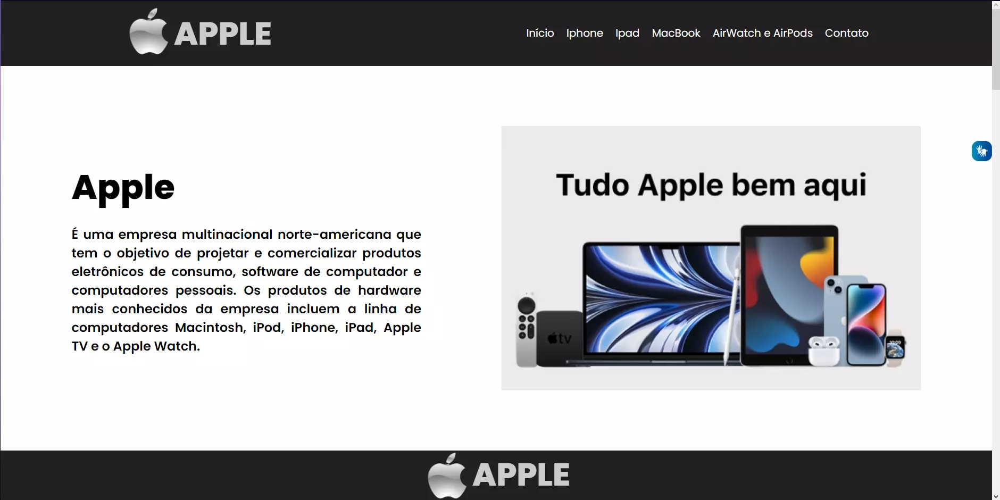
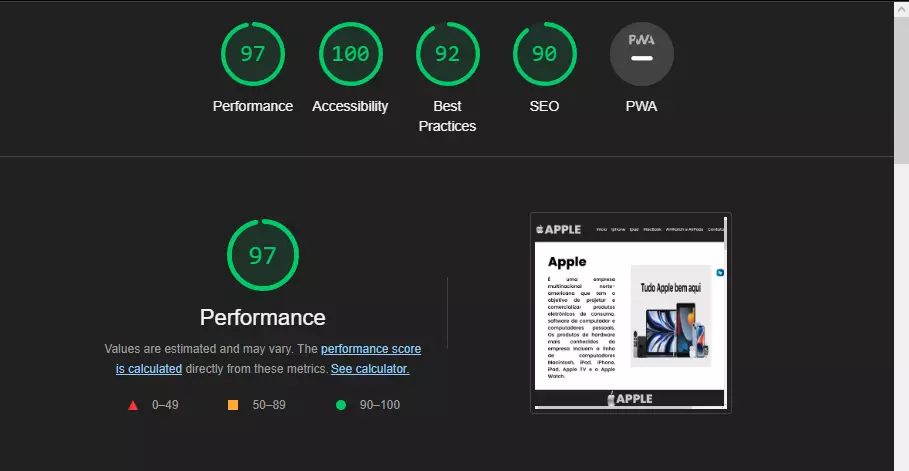

# ONE PAGE APPLE

- [Link do site](https://luyz-dev.github.io/one-page-2022/ds1t-a/Luiz%20Gustavo/index.html)

---
## Sobre

Site do tipo one-page sobre a grande companhia de tecnologia Apple. 
O objetivo deste projeto é colocar em prática os conhecimentos adquiridos no curso de Desenvolvimento de Sistemas do [Senai Jandira](https://jandira.sp.senai.br/). 
---
## Tecnologias Utilizadas

- HTML
- CSS
- Responsividade
- Markdown
- Vlibras 
- Figma
- FontAwesome
---
## Relatório do lighthouse

Nota que o lighthouse deu ao meu site. 

---
## Protótipo do site 

Antes da realização do site, fiz o protótipo no figma, tanto do desktop, quanto do mobile.

- [Clique aqui para ver o figma](https://www.figma.com/file/U3lJpIFlhrdxBW64o9ec0Q/ONE-PAGE-APPLE?node-id=0%3A1&t=ffipryhIWhAzuoYM-0)

## Autor
- [Luiz Gustavo](https://github.com/luyz-dev)

---
## Contatos
- [Instagram](https://www.instagram.com/luyz.dev/)
- [Linkedin](https://www.linkedin.com/in/luyz-dev)
- WhatsApp: (11) 9-6759-3159

