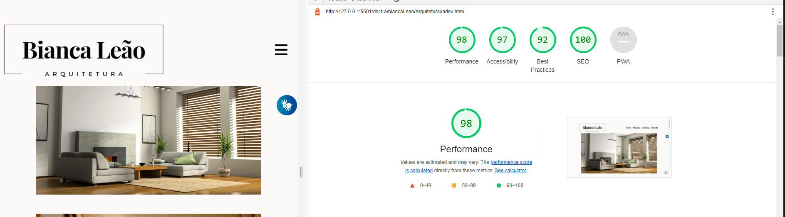

# DS1T - A - BIANCA LEÃO

- [Link do site](https://fernandoleonid.github.io/one-page-2022/ds1t-a/biancaLeao/Arquitetura/index.html)

---

## Sobre

Site do tipo one-page sobre uma empresa ficticia de arquitetura. 
O objetivo deste projeto é colocar em prática os conhecimentos adquiridos no curso do [Senai Jandira](https://jandira.sp.senai.br/). 

---

## Tecnologias Utilizadas

- HTML
- CSS
- Responsividade
- Markdown
- Vlibras 
- Figma
- FontAwesome

---

## Relatório do lighthouse

Nota que o lighthouse deu ao meu site. 

---

## Protótipo do site 

    Antes da realização do site, fiz o protótipo no figma, tanto do desktop, quanto do mobile.

- [Clique aqui para ver o figma](https://www.figma.com/file/l7qoeaIasBNTcCIZwG8OZ5/Arquitetura?node-id=0%3A1&t=k8gkI86VigJfFll0-0)

## Autora

- [Bianca Leão](https://github.com/leaobia)
