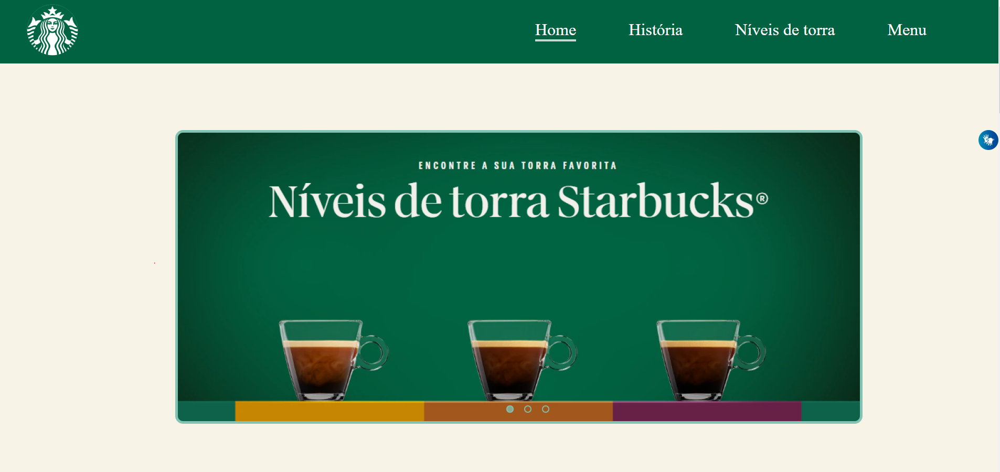

# Somativa LIMA

---

## Sobre
Site utilizado como método de Avaliação Somativa com a temática da Starbucks. Com a implementação de tecnologias como o VLibras, JavaScript, LightHouse e Responsividade para IPhone SE.
O objetivo deste projeto é colocar em prática os conhecimentos sobe a criação de sites adquiridos no curso do [SENAI Jandira](https://jandira.sp.senai.br/).

---

## Tecnologias ultilizadas

- HTML5
- CSS3
- Figma
- VLibras
- JS
- Responsividade
- Markdown

---

## LightHouse

---

## Design

Layout baseado no [FIGMA](https://www.figma.com/file/X3QGzBILrZBTB1cNtDHfnJ/Starbucks?node-id=0%3A1&t=ZBGnCqqfRZ3dGL7W-0)

---

## Autor 

- [Julia Soares](https://github.com/Xul14)