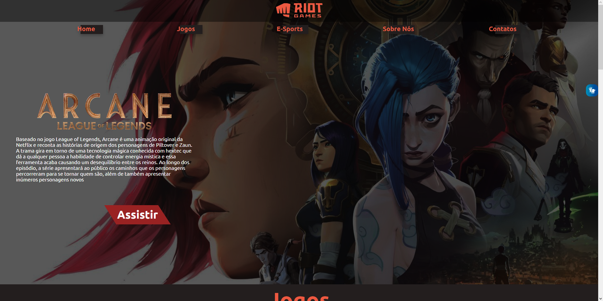
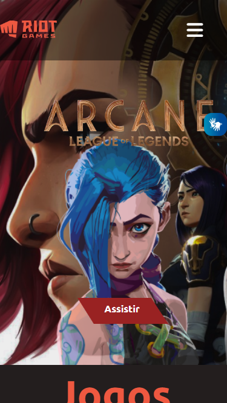

# Riot Games - Empresa De Entreterimento

## Desktop

 

## Mobile

---

## Links

- GitHub Repositório: [Clique aqui!](https://github.com/Ikaris43/one-page-2022-leonid)
- GitHub Page: [Clique aqui!](fernandoleonid.github.io/one-page-2022/ds1t-a/marceloGabril-riotGames)

---

## Sobre o projeto

Esse site tipo one-page tem o intuito de divulgar a empresa Riot Games.

O Objetivo do projeto era não só colocar em prática os ensinamentos de criação de sites do [Senai Jandira](https://jandira.sp.senai.br/) mas também pesquisar por conta própria novas tecnologias para a aprendizagem atráves da prática e é claro desenvolver um site original, com a individualidade do criador.

---

## Tecnologias Utilizadas
- HTML5
- CSS3
- Responsividade
- FontAwesome
- JS
- Figma
- Markdown
- Vlibras

---

## Relatório Lighthouse

---

## Protótipo

Para a realização do projeto, antes de tudo, o planejamento e o design foram desenvolvidos pelo Figma.

- [Clique aqui e veja o design](https://www.figma.com/file/oUXWCJVss9LIoXvHfgcJXW/Riot-Games?node-id=0%3A1&t=Odg3lY4eLwPksWdf-0)

## Autoavaliação

- [x] Prototipou o site utilizando o Figma?
- [x] Criou um cover, do figma, para divulgar o projeto?
- [x] A navegabilidade é intuitiva?
- [x] As cores, imagens, botões, links e outros elementos tem designer padronizado (Identidade visual)
- [x] Codificou o site conforme planejado(protótipo)?
- [x] [O site está responsivo?]
- [x] Usou unidades de medida relativas, ou seja, criou um site flexivel?
- [x] Utilizou media queries para a responsividade?
- [x] Utilizou a ferramenta lighthouse para verificar o desempenho, acessibilidade, boas praticas e SEO?
- [] Otimizou as imagens para melhorar o desempenho?
- [x] O site foi codificado pensando na acessibilidade?
- [x] Implementou o vlibras no site?
- [x] Usou as TAG HTML pensando na semântica?
- [x] Nomeou as classes utilizando algum padrão?
- [x] Assinalou o projeto?
- [x] As seções criadas tem coerência com o projeto?
- [x] As seções estão organizadas seguindo algum objetivo?
- [x] O arquivo README descreve o projeto?
- [x] O texto do README é objetivo e sucinto?
- [x] O screenshot mostra um pouco do projeto?
- [x] Existe um link para o figma no README?
- [x] Existe um link para o github page no README?
- [x] Existe um link do autor do projeto no README?
- [x] Fez a autoavaliação?

## Autor

- [Marcelo Gabriel - Ikaris43](https://github.com/Ikaris43)
