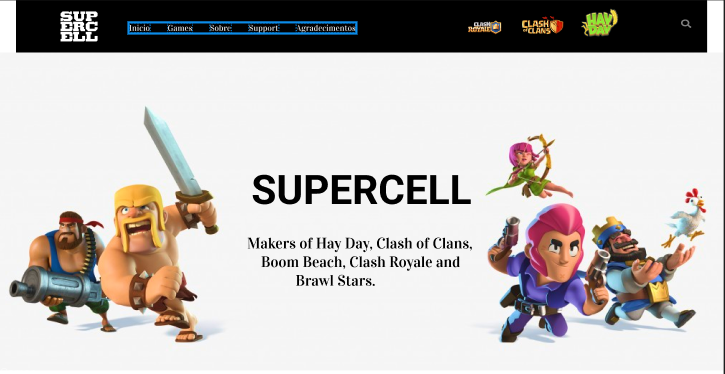

# site-supercell

//Não consegui colocar o link pois o git não está indo

---
## Sobre
Site é pagina para o trabalho final do semestre.
O objetivo deste projeto é colocar em prática os conhecimentos, sobre desenvolvimento de sites, adquiridos no curso do SENAI Jandira 

---
### tecnologias utilizadas
- HTML5
- CSS3
- Responsividade
- JavaScript

---
### Autor 
- [João Victor da Silva](https://github.com/Ratinho253) 

- [Figma](https://www.figma.com/file/W2rtrGVNqsK48h4yoqPleN/Untitled?node-id=215%3A7&t=Zc8ps83QdY0mwKqE-0) 

