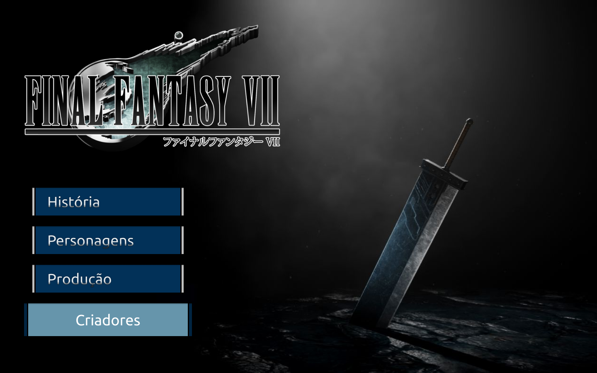

# Final Fantasy VII

[Clique aqui](https://github.com/MateusAlves595/one-page-2022.git) para acessar o site.
---
## Sobre
Site do tipo one page para falar sobre o jogo Final Fantasy VII, comentando sobre sua história, processo de criação e criadores.
O objetivo deste projeto é colocar em prática os conhecimentos, sobre o desenvolvimento de sites, adquiridos no curso do [SENAI Jandira](https://jandira.sp.senai.br/).
---
## Figma
[Clique aqui](https://www.figma.com/file/LXNZ1uouC9pzKNw9nRBZVd/Final-Fantasy-VII?node-id=0%3A1&t=7340cyygB5Eab5Yo-0) para acessar o projeto do Figma

---
## Tecnologia utilizada
- HTML5
- CSS3
- Responsividade
- Markdown

---
## Autor
- [Mateus Alves](https://github.com/MateusAlves595)