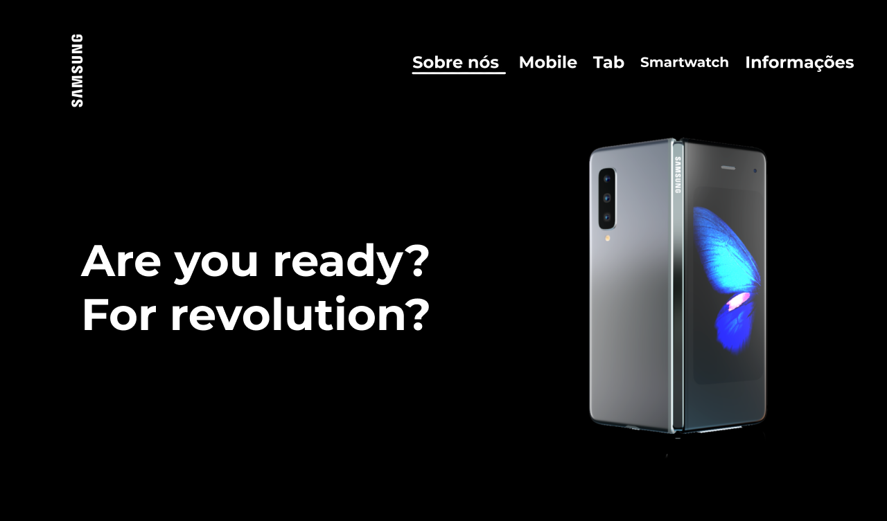

# ONE PAGE SAMSUNG

- [Link do site](https://fernandoleonid.github.io/one-page-2022/ds1t-b/andreLuiz/index.html)

---
## Sobre

Site do tipo one-page sobre a grande companhia de tecnologia Apple. 
O objetivo deste projeto é colocar em prática os conhecimentos adquiridos no curso de Desenvolvimento de Sistemas do [Senai Jandira](https://jandira.sp.senai.br/). 
---
## Tecnologias Utilizadas

- HTML
- CSS
- Responsividade
- Markdown
- Vlibras 
- Figma
- FontAwesome
---
## Relatório do lighthouse

Nota que o lighthouse deu ao meu site. 

---
## Protótipo do site 

Antes da realização do site, fiz o protótipo no figma, tanto do desktop, quanto do mobile.

- [Clique aqui para ver o figma](https://www.figma.com/file/2YiqCnZb1wCcKDNVoVPBSt/Samsung-One-Page?node-id=0%3A1&t=UKdNqGn6pJ6QeFCR-0)

## Autor
- [André Luiz](https://github.com/AndreLuisConstantino)

---
## Contatos
- [Instagram](https://www.instagram.com/andreluisconstanino/)
- [Linkedin](https://www.linkedin.com/in/andré-luiz-constantino-4b779124a/)
- WhatsApp: (11) 97049-3172

