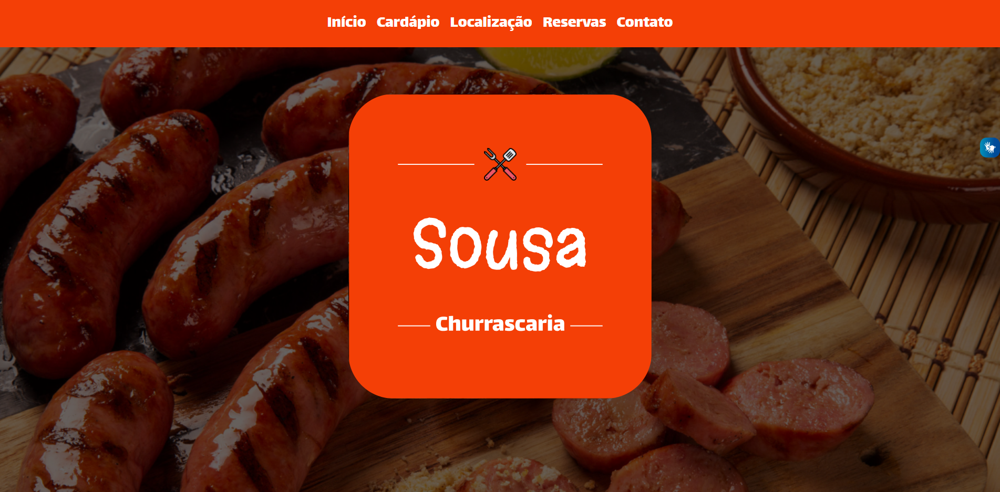

# Sousa Churrascaria

[Clique aqui](https://www.figma.com/file/8KL6r2pXDbwnipDerQbEFf/Sousa_Churrascaria?node-id=33%3A63&t=A9CYBBjUmTss5svY-0) para acessar o projeto no Figma.

---
## Sobre
Um projeto do tipo one-page, com o tema livre. Nesse caso, o tema escolhido foi uma churrascaria.
O objetivo desse projeto é colocar em prática os conhecimentos e ser avaliado.

## Tecnologias utilizadas
- HTML5
- CSS3
- Javascript (Foi utilizado o "Vlibras", uma tecnologia de acessibilidade)
- Responsividade
- Markdown

---
## Autor
- [Claudio Sousa](https://github.com/ClaudioSousa44)