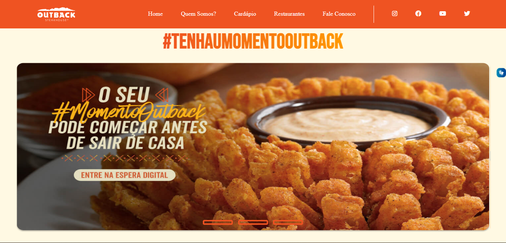

# Site Outback

[CLIQUE AQUI PARA ABRIR O SITE](https://vickr-g.github.io/projeto-outback-/)

---
## Sobre
Site do tipo landing page para divulgar o meu site sobre o restaurante Outback. O objetivo desse projeto é colocar em prática os conhecimentos, sobre desenvolvimentos de sites, adquiridos no curso do SENAI Jandira na disciplina de Linguagem de Marcação.

---
## Tecnologias usadas
- HTML 5
- CSS3
- Responsividade
- Markdown
---
## Autor
-[ Git Victoria Gindre](https://github.com/vickr-g)
-[Figma Victoria Gindre](https://www.figma.com/file/mUGUAC0320qnQBIymluC7B/Outback---super-original?node-id=0%3A1&t=Ek4xM6GTvdC8fSwA-0)
# projeto-site-outback
