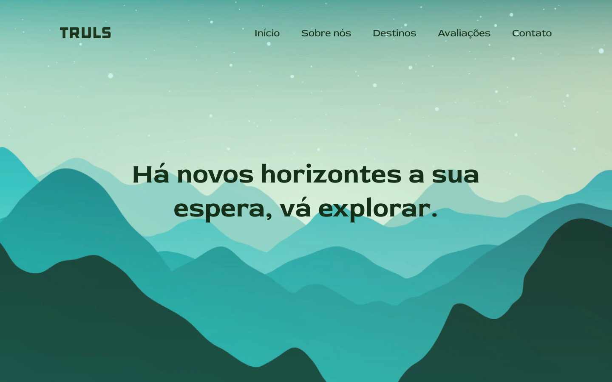

# TRVLS Turismo

---

## Sobre

Site do tipo one-page para divulgar uma empresa de turismo (TRVLS). O objetivo do projeto é colocar em prática os conhecimentos adquiridos em aula no Senai Jandira.

---

## Tecnologias utilizadas

- HTML5
- CSS3
- Responsividade
- Markdown
- Figma
- VLibras
---
### [Figma](https://www.figma.com/file/1q7DCs6E6gG9J6zQRctH1e/TRVLS?node-id=37%3A2&t=QQh3zLRD0eL3LGGs-0)
---
## Autora
[Yasmin Gonçalves](https://github.com/yasmingcv)